# Linuxboy (WIP)
Linuxboy is a feature-rich (hopefully) Game Boy emulator mostly intended to be used as a full-blown debugger. I'll most likely write a series of blog posts explaining the inner working in the near future to help emulator beginners understand how the Game Boy worked and how to implement it in code, but for now just I'll focus on actually developing the damn thing.

## Status
Currently the emulator supports most of the features of the original Game Boy except for audio and other types of memory banking which are not MBC1A

## TODO's
### Near future TODO's
- [ ] Enable/Disable Bootrom
- [ ] Finish memory banking
- [ ] Remove Bootrom dependency
- [ ] Implement Saving
- [ ] Fix sprites rendering priority

### *I'll do it someday, stop bothering* TODO's
- [ ] Audio support
- [ ] Button remapping
- [ ] Joypad support
- [ ] Graphical debugger

## Tested Games List
Keep in mind that full compatibility doesn't mean perferct emulation, it just means that no errors have been found yet.


| Game | Compatibility | Notes |
| --- | --- | --- |
| Tetris                                     | 🔵🔵🔵🔵🔵 |    |
| Dr. Mario                                  | 🔵🔵🔵🔵🔵 |    |
| Bubble Ghost                               | 🔵🔵🔵🔵🔵 |    |
| Kirby's Dream Land                         | 🔵🔵🔵🔵⚪️ |   Kirby's inhale behaves weirdly sometimes. |
| Kirby's Dream Land 2                       | ⚪️⚪️⚪️⚪️⚪️ |   Won't boot. |
| Legend of Zelda, The: Link's Awakening     | 🔵🔵🔵⚪️⚪️ |   Tiles sometimes don't load properly when switching areas. |
| Mega Man II                                | 🔵🔵🔵🔵⚪️ |   Sprites are sometimes rendered below tiles. (Air Man) |
| Metroid II: Return of Samus                | 🔵🔵🔵🔵⚪️ |   Samus is invisible for the first part of the game. |
| Tennis                                     | 🔵🔵🔵🔵🔵 |    |
| Super Mario Land                           | 🔵🔵🔵🔵🔵 |    |
| Super Mario Land 2: 6 Golden Coins         | 🔵🔵🔵🔵🔵 |    |
| Wario Land: Super Mario Land 3             | 🔵🔵🔵🔵⚪️ |   Sprites sometimes flicker when in little Wario mode |
| Pac-Man                                    | 🔵🔵🔵🔵🔵 |    |
| Donkey Kong                                | ⚪️⚪️⚪️⚪️⚪️ |   Won't boot. |
| Castlevania II: Belmont's Revenge          | 🔵🔵🔵⚪️⚪️ |   HUD is displayed weirdly, tiles pop in and out mid game. |
| F-1 Race                                   | ⚪️⚪️⚪️⚪️⚪️ |   Won't boot. |

## Screenshots
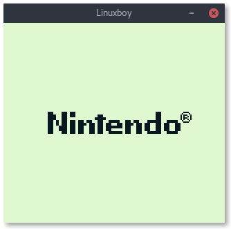
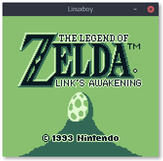
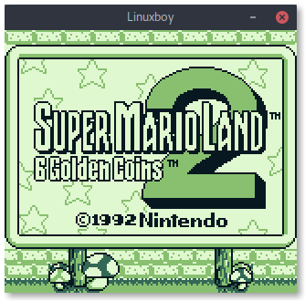
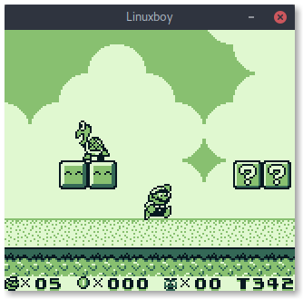
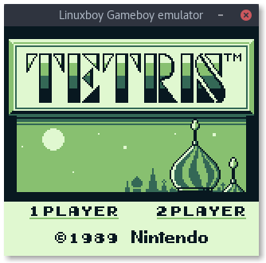
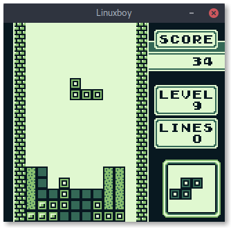
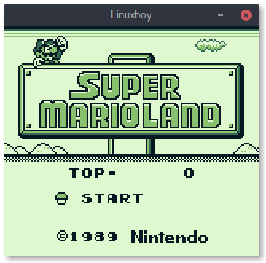
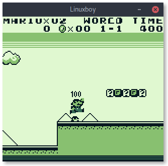
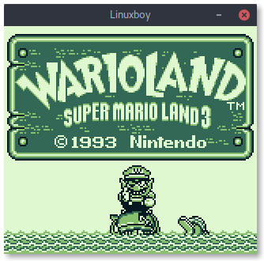
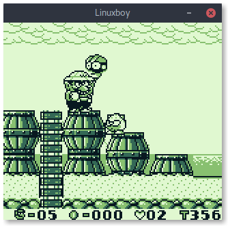
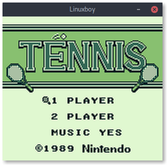
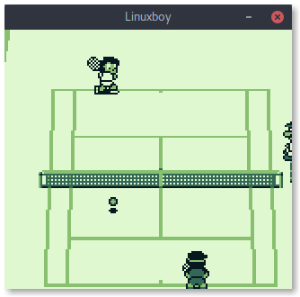
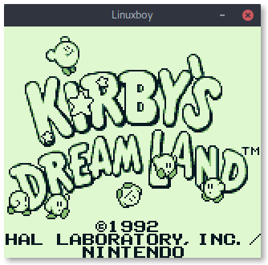
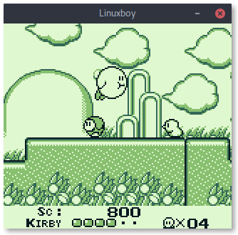
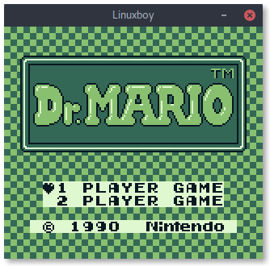
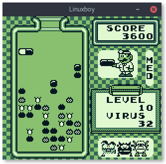
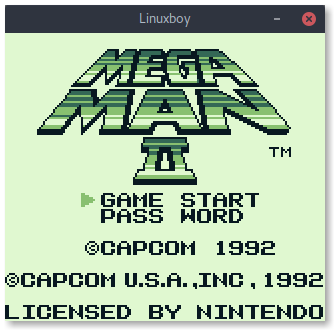
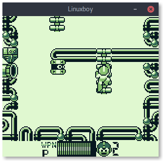
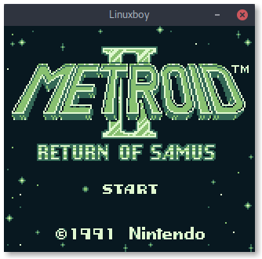
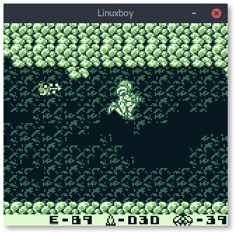
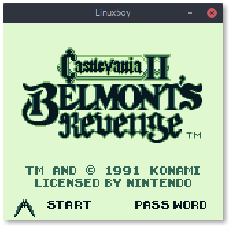
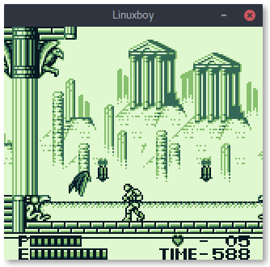

## Building
Linuxboy depends on SDL2 and GLEW for rendering which can be easily installed by using your preffered package manager.
To compile just run:
```
make
```
And to run:
```
./lboy rom [-options]
```

## Command line options
```
usage: %s rom [-h] [-b addr] [-s scale [-x width -y height]] [-w addr] [-l state]
```

- -b, --break:  set breakpoint at 'addr' (hex).
- -h, --help:   print help message and quit.
- -s, --scale:  set screen width to 160 * 'scale' and screen height to 144 * 'scale'.
- -x, --width:  set screen width to 'width'.
- -y, --height: set screen height to 'height'.
- -w, --watch:  add 'addr' to the watch list.
- -l, --state:  load CPU state from 'state'.

## Controls
| Key | Action |
| --- | --- |
| w   | UP |
| s   | DOWN |
| a   | LEFT |
| d   | RIGHT |
| j   | A |
| k   | B |
| u   | START |
| i   | SELECT |

